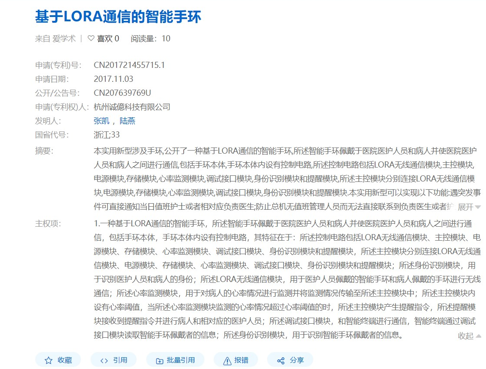
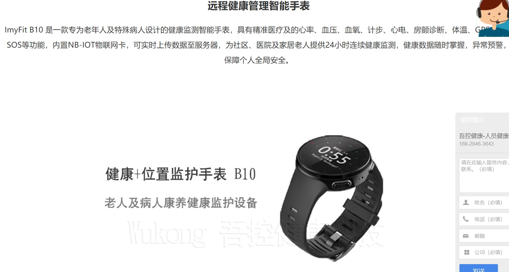
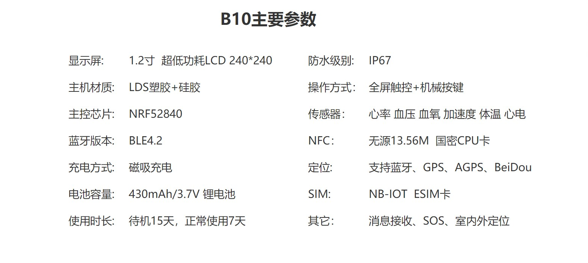
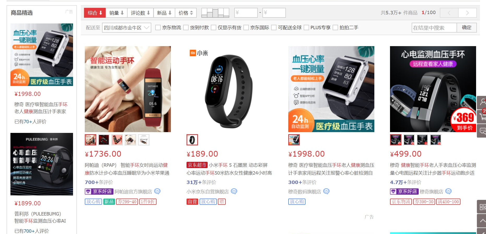

项目名称：Health-Monitor 
作者姓名                            github ID 
2019112411张锴                    shinomiyaqaq 
2019112400郭恺                    Gokaii 
2019112403何厚谊                  Hackeryii 
2019112401龚真晓                  gongzhenxiao 
2019112410宗冕                    Zongmian 
2019112424王轩杨                  XuanYangW 

问题剖析  
现状：随着我国老龄化的日益加重，养老院将在社会养老中起到越来越大的作用。 
***
分析：很多养老院并未配备实时健康监测系统来监测每个老人的身体健康 ，有的地方通过健康手环来收集老人的健康信息，但存在以下几个问题：高端养老院使用的健康监测设备昂贵，无法在普通养老院中普及；市面上手环质量参差不齐，价格普遍较高，会加重老人家庭的经济负担；手环续航普遍不长，隔一段时间就要充电；大多手环针对个人用户，通过蓝牙或蜂窝数据网传输到一个终端，应用场景较为局限。 
***
访谈提纲  
1.	希望能采集老人哪些生命体征进行监测？（如心率、血氧浓度等）  
2.	对产品的需求量大概有多少？  
3.	对产品的价格有什么样的预期？  
4.	对产品的续航、可穿戴性有什么要求？  
5.	配套的数据库管理与分析系统有什么要求？  
***
1.心率、血氧、体温等 
2.几十到几百 
3.单个产品200元以内 
4.续航尽可能久、戴起来舒适不影响正常生活 
5.有相应的数据查看和管理 

***
意见：利用Lora技术，将多个结点的数据传输到一个网关，很适合养老院这样的使用场景，且其低成本、低功耗、传输距离远的特性让我们的产品更有优势。 
***
问题定义 
制作基于LORA的实时监测养老院老人的身体健康情况（心率、血氧）可穿戴设备 
***
国内外产品现状（市场调研） 

***
技术指标需求：  
| 指标   | 必须实现                                                             | 希望实现                                                |
| -------- | ------------------------------------------------------------------------ | ----------------------------------------------------------- |
| 成本   | 低于100元                                                             | 越低越好                                                |
| 材料   | 1.能够在（0℃到40°C的环境下正常工作）  2.具有较好的可穿戴性  3.不超过100g | 1.越轻越好  2.能在比较恶劣的环境下使用（低于0°C或高于40°C） |
| 制造标准 | 符合LORA通信协议                                                   |                                                             |
| 安全   | 通过国家安全标准，对人体无毒无害                         |                                                             |
| 环境   | 环境友好，产生较少污                                           |                                                             |
| 性能   | 测量温度误差不超过±0.5°C                                      | 越精确越好                                             |
| 运输   | 易于携带                                                             |                                                             |
***
方案比较 
  
  

| 评价标准 | 比重 | 方案一 | 方案二 |
| -------- | ---- | ------ | ------ |
| 易佩戴性 | 0.5  | 8      | 9      |
| 成本   | 0.25 | 9      | 8      |
| 易生产性 | 0.25 | 7      | 9      |
| 总得分 | 1    | 8.25   | 8.5    |

最终设计：设计一个手腕佩戴式心率监测装置，开发板与lora模块装在一个小木盒里，引脚简通过短导线之间连接。

材料清单：
| 序号 | 名称           | 型号/规格 | 封装 | 品牌  |
| ---- | ---------------- | ---------- | ------ | ------- |
| 1    | esp32开发板   | NodeMCU-32 | DIP-38 | 安信可 |
| 2    | LoRa芯片       | Ra-01S     | SMD-16 | 安信可 |
| 3    | MAX30102心率监测 |            |        | TELESKY |
| 4    | 纽扣电池 |    CR2430        |        | 南孚 |
***
性能评价  
供电：3V纽扣电池  
工作频段： 486.5 MHz  
无毒无污染  
功耗低续航持久
***
代码：  
共有两个代码，一个是心率采集的代码，另一个是接收的代码  
需要在Arduino的环境下编译和上传，由于用到了MAX30102传感器，所以需要用安装包加载库文件，要用到头文件"MAX30105.h"和"heartRate.h"  
同时又用到了lora发送和接收模块，所以用到了<LoRaNow.h>、<WiFi.h>、<Wire.h>,要在库中提前添加  
还要提前加载开发板esp32才能进行上传
***
团队介绍  
组长      2019112411张锴 ：擅长提供创意以及编写与调整代码，安排工作，监督工作进度  
          2019112400郭恺 ：擅长代码审核与优化  
          2019112403何厚谊：擅长提供创意以及机器组装与调试  
          2019112401龚真晓：擅长电焊及机器组装  
          2019112410宗冕 ：擅长信息检索及产品检验与细节改善  
          2019112424王轩杨：擅长信息检索以及总结并运用于实际  	
***

团建计划  
QQ群：及时共享工作进度  
奶茶店：头脑风暴  
聚餐：一起讨论解决遇到的问题  
实地考察养老院情况和老人们的需求  
***
WEEK10-WEEK12:收集资料，购置材料  
WEEK13-WEEK15(deadline):代码编写与调试，产品完善，报告编写  
WEEK16(真·deadline):一切就绪，做汇报  

